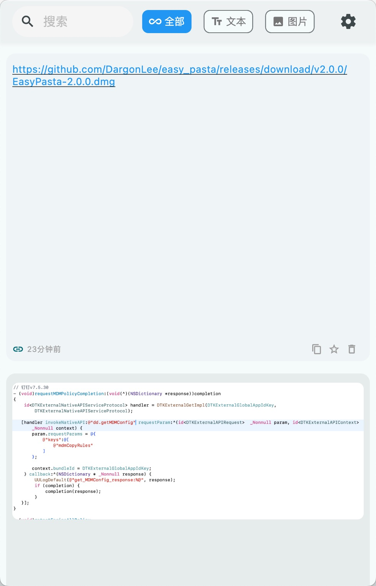
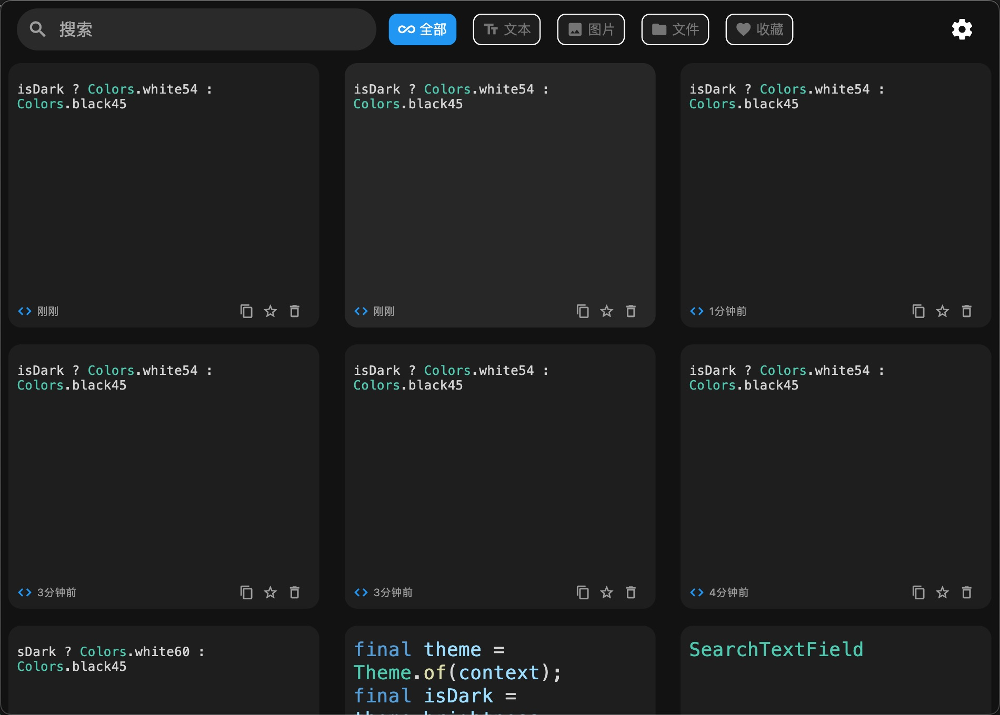

# EasyPasta

<p align="center">
  
</p>
<p align="center">
  
</p>

<p align="center">
  
</p>

<p align="center">
  
</p>

## 📝 概述

EasyPasta 是一款强大的跨平台剪贴板管理工具，专为提升您的工作效率而设计。它能够自动记录您的复制历史，并通过简单的快捷键操作随时调用，让信息的复制和粘贴变得更加便捷。

## 🛠️ 开发环境

- Flutter 3.24.4
- Dart 3.5.4

## 📦 下载

[macOS](https://github.com/DargonLee/easy_pasta/releases/download/v2.0.0/EasyPasta-2.0.0.dmg)

Windows (暂未发布，欢迎贡献编译版本)

```shell
scripts\build.bat
```

Linux (暂未发布，欢迎贡献编译版本)

```shell
./scripts/build.sh
```

### ✨ 核心特性

- 🔒 **本地存储**: 所有数据均存储在本地，确保您的隐私安全
- 🔍 **智能搜索**: 快速查找历史剪贴板内容
- ⌨️ **快捷键支持**: 自定义快捷键，随时唤起面板
- 🖼️ **多格式支持**: 支持文本、图片、文件等多种格式
- 🚀 **启动项**: 支持开机自启动
- 💪 **跨平台**: 支持 macOS、Windows 和 Linux

## 🖥️ 系统要求

- macOS 10.15 或更高版本
- Windows 10 或更高版本
- Linux (Ubuntu 20.04 或其他主流发行版)

## 📥 安装指南

### macOS

1. 下载最新的 DMG 安装包
2. 打开 DMG 文件
3. 将 EasyPasta 拖入 Applications 文件夹
4. 从 Applications 文件夹启动 EasyPasta

### Windows

1. 下载最新的 Windows 安装包
2. 运行安装程序
3. 按照安装向导完成安装

### Linux

1. 下载最新的 .deb 包（Ubuntu/Debian）
2. 运行以下命令安装：

```bash
sudo dpkg -i easy_pasta_linux_amd64.deb
```

## 🎯 使用方法

1. **启动应用**

   - 启动后，状态栏会显示 EasyPasta 图标

   <p align="center">
     
   </p>

2. **访问剪贴板历史**

- 点击状态栏图标
- 或使用默认快捷键 `Cmd+Shift+V` (macOS) / `Ctrl+Shift+V` (Windows/Linux)

3. **使用剪贴板内容**

- 点击复制图标
- 双击复制到系统剪贴板
- 在目标位置粘贴

4. **剪贴板操作**

- 点击复制按钮，复制内容到系统剪贴板
- 点击收藏按钮，将内容添加到收藏列表
- 点击删除按钮，删除选中的内容

5. **预览**

- 鼠标放在卡片上，按空格键预览

6. **关闭窗口**

- 使用快捷键 `Cmd+W` (macOS) / `Ctrl+W` (Windows/Linux)

7. **退出应用**

- 使用快捷键 `Cmd+Q` (macOS) / `Ctrl+Q` (Windows/Linux)

## ⚙️ 配置选项

- **快捷键设置**: 自定义唤起快捷键
- **启动选项**: 设置开机自启动
- **历史记录**: 配置历史记录保存数量

## 📄 许可证

本项目基于 MIT 许可证开源 - 查看 [LICENSE](LICENSE) 文件了解更多详情

## ☕️ 支持项目

如果您觉得这个项目对您有帮助，欢迎请我喝杯咖啡 ：）

<div>
  
</div>

<div>
  
</div>

<p align="center">
  Made with ❤️ by harlans
</p>
