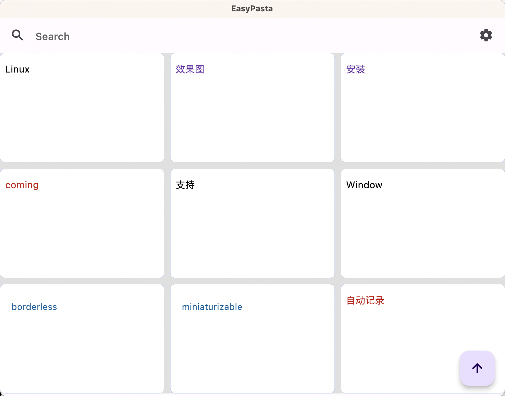
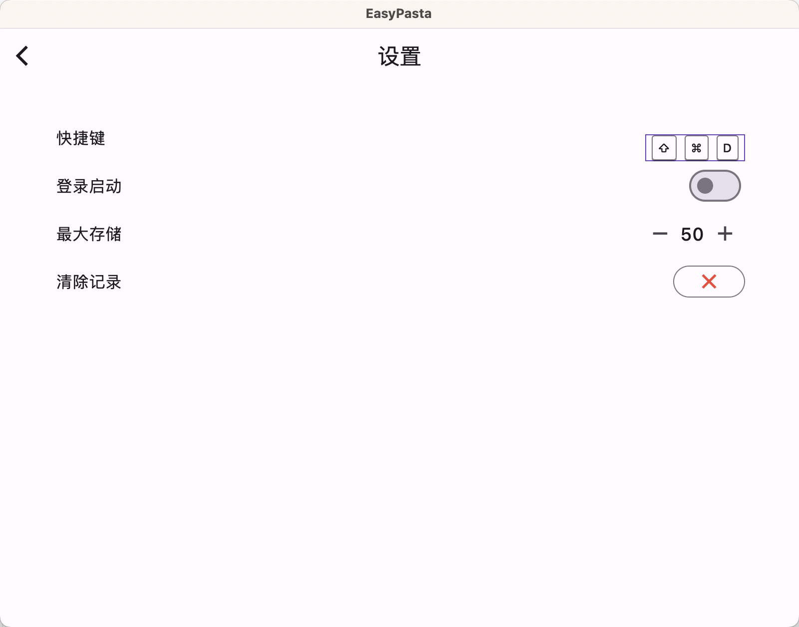

### EasyPasta

#### 概要

> EasyPasta是一个 PC 平台的剪贴板记录工具，可以在你 copy 内容的时候自动记录当前剪贴板的内容。在你想要使用的时候双击即可把需要 copy 的内容 copy 到当前的剪贴板中。然后在想要复制的地方直接粘贴即可。

#### 平台

- 支持 Mac
- Window `coming soon`
- Linux `coming soon`

#### 效果图

#### 安装

- 下载 zip 包
- 解压把 App 文件放到系统的 Application 目录下，然后点击运行即可。

#### 使用

- 点击运行后状态栏会出现如下图的图标（代表运行成功）

- 需要复制的时候，
  - 1、点击即可显示主页面

  - 2、配置快捷键，直接使用快捷键即可显示主页面

- 然话双击你想要复制的内容，在你想要粘贴的地方直接粘贴即可

#### 更新记录：

- v0.9.0
  - 增加搜索功能
  - 增加设置界面
  - 设置快捷键随时呼出面板
  - 设置登录启动
- v0.8.0
  - 第一个可用版本

#### TODO:

- 提供第三方同步方案，避免隐私问题，mac/ios 可以用 iCloud/windows 可以利用坚果云等(from:**[SuperXRay](https://www.v2ex.com/member/SuperXRay)**)
