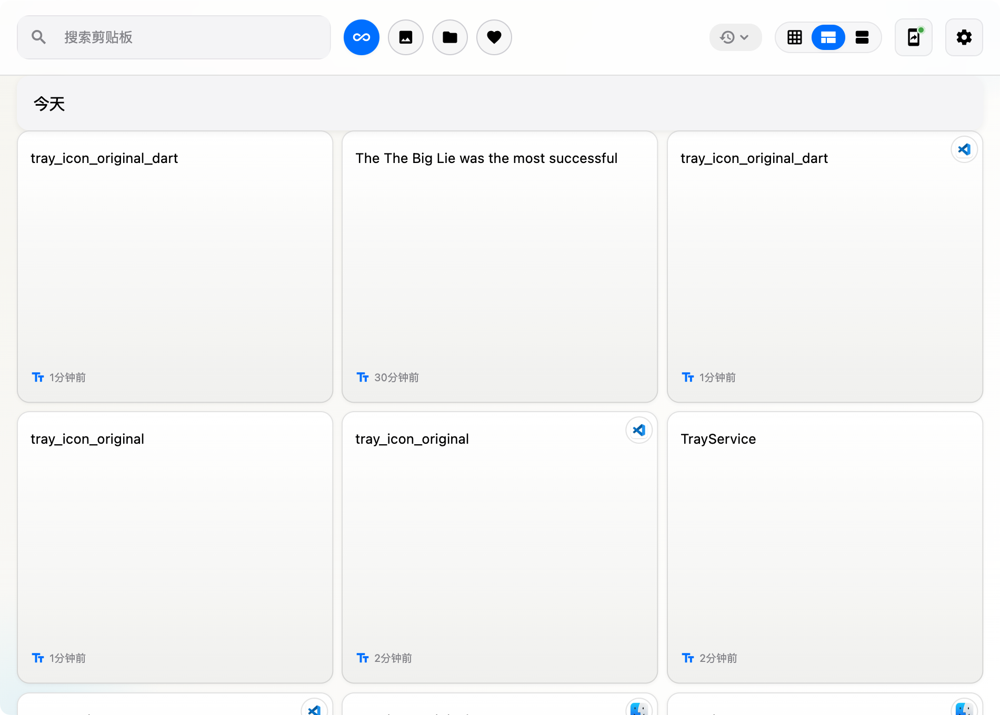
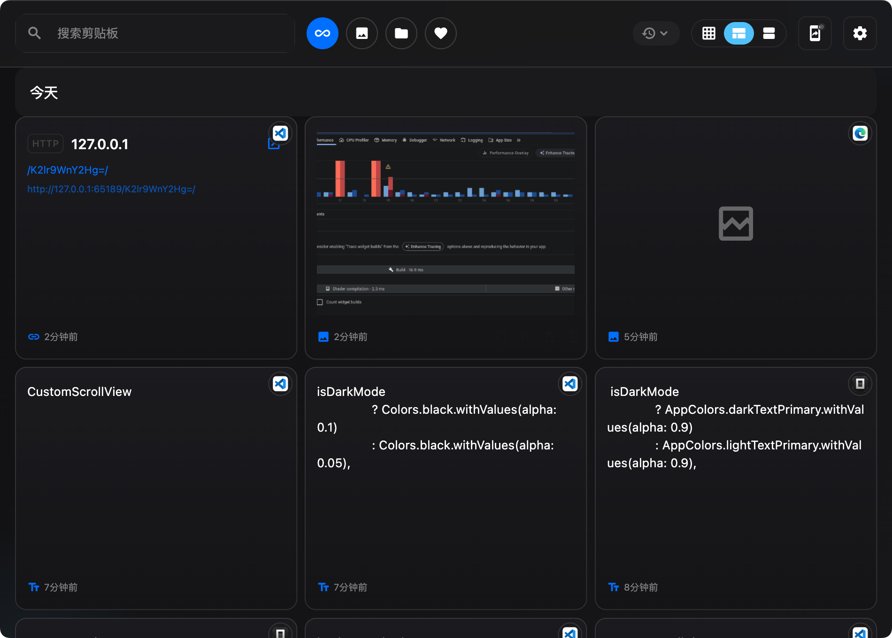

# EasyPasta

<div align="center">
  
  
</div>

<p align="center">
  <a href="https://github.com/DargonLee/easy_pasta/releases/latest">
    
  </a>
  <a href="LICENSE">
    
  </a>
  
  
</p>

<p align="center">
  <a href="#-概述">概述</a> •
  <a href="#-核心特性">特性</a> •
  <a href="#-下载">下载</a> •
  <a href="#-安装指南">安装</a> •
  <a href="#-使用方法">使用</a> •
  <a href="#-配置选项">配置</a> •
  <a href="#-系统权限说明">权限</a> •
  <a href="#-路线图">路线图</a> •
  <a href="#-贡献">贡献</a>
</p>

---

## 📝 概述

**EasyPasta** 是一款强大的跨平台剪贴板管理工具，专为提升您的工作效率而设计。

**核心优势：**
- 🚀 **高性能**：优化的滚动性能达 60 FPS，流畅无卡顿
- 🔒 **隐私安全**：所有数据本地存储，不上传云端，确保您的隐私安全
- ⌨️ **快捷键操作**：随时唤起，快速粘贴，让复制粘贴更便捷
- 📱 **跨平台**：支持 macOS、Windows 和 Linux
- 💡 **智能识别**：自动识别 URL、代码、JSON、命令等不同类型的内容

## ⭐ 核心特性

| 特性 | 说明 |
|------|------|
| 🔒 **本地存储** | 所有数据均存储在本地 SQLite 数据库，不上传云端 |
| 🔍 **智能搜索** | 基于 FTS5 全文检索，毫秒级响应，快速查找历史内容 |
| ⌨️ **快捷键支持** | 自定义快捷键，随时唤起面板（默认 `Cmd+Shift+V`） |
| 🖼️ **多格式支持** | 支持文本、图片、文件链接等多种剪贴板格式 |
| 🎯 **自动粘贴** | 选中内容后自动粘贴到目标应用（可选开启） |
| 📱 **多端同步** | 支持移动端浏览器同步（需开启 Portal 服务） |
| 💫 **分组显示** | 按时间智能分组，今日、昨日、更早一目了然 |
| ⭐ **收藏功能** | 重要内容一键收藏，不被自动清理 |

## 📦 下载

| 平台 | 版本 | 下载链接 | 构建状态 |
|------|------|----------|----------|
|  | ✅ v2.3.0 | [下载最新版](https://github.com/DargonLee/easy_pasta/releases/latest) | ✅ 已发布 |
|  | 🚧 Beta | [查看 Releases](https://github.com/DargonLee/easy_pasta/releases) | 🧪 待开发 |
|  | 🚧 Beta | [查看 Releases](https://github.com/DargonLee/easy_pasta/releases) | 🧪 待开发 |

### 🛠️ 自行构建

```bash
# 克隆仓库
git clone https://github.com/DargonLee/easy_pasta.git
cd easy_pasta

# 安装依赖
flutter pub get

# 运行调试
flutter run

# 构建发布版本
# macOS
flutter build macos --release
```

## 💻 系统要求

- **macOS**: 10.15 (Catalina) 或更高版本，支持 Intel 和 Apple Silicon
- **Windows**: Windows 10 或更高版本，64位系统
- **Linux**: Ubuntu 20.04+ / Fedora 34+ / Arch Linux 或其他主流发行版

## 📥 安装指南

### macOS

1. **下载安装包**
   - 从 [Releases](https://github.com/DargonLee/easy_pasta/releases/latest) 下载最新的 `.zip` 文件

2. **安装应用**
   ```bash
   # 解压
   unzip EasyPasta-macos.zip
   
   # 移动到 Applications
   mv EasyPasta.app /Applications/
   ```

3. **首次运行**（重要！）
   - 首次打开时，系统会提示"无法验证开发者"
   - **解决方法**：
     - 打开 **系统设置** > **隐私与安全性**
     - 在"安全性"选项卡下方，点击 **仍要打开**
     - 或者在 Finder 中右键点击 App，选择"打开"

4. **授予必要权限**（详见下方[系统权限说明](#-系统权限说明)）


## 🎯 使用方法

### 1️⃣ 启动应用

启动后，EasyPasta 会在后台运行，状态栏/系统托盘显示应用图标。

<div align="center">
  
</div>

### 2️⃣ 访问剪贴板历史

| 方式 | 操作 |
|------|------|
| **快捷键** | `Cmd+Shift+V` (macOS) / `Ctrl+Shift+V` (Windows/Linux) |
| **点击图标** | 点击状态栏/系统托盘图标 |

### 3️⃣ 使用剪贴板内容

| 操作 | 说明 |
|------|------|
| **单击** | 选中卡片，高亮显示 |
| **双击** | 复制到系统剪贴板并关闭窗口 |
| **空格键** | 预览内容（鼠标悬停在卡片上时） |

### 4️⃣ 快捷操作

<div align="center">

| 功能 | 操作方式 |
|------|----------|
| 📋 复制 | 点击卡片上的复制按钮 |
| ⭐ 收藏 | 点击收藏按钮，收藏内容不会被自动清理 |
| 🗑️ 删除 | 点击删除按钮，移出历史记录 |
| 🔍 搜索 | 在顶部搜索框输入关键词 |
| 🏷️ 筛选 | 按类型筛选：全部、文本、图片、文件、收藏 |

</div>

### 5️⃣ 窗口操作

| 操作 | 快捷键 |
|------|--------|
| 关闭窗口 | `Cmd+W` (macOS) / `Ctrl+W` (Windows/Linux) |
| 退出应用 | `Cmd+Q` (macOS) / `Ctrl+Q` (Windows/Linux) |

## ⚙️ 配置选项

在设置面板中，您可以自定义以下选项：

| 设置项 | 说明 |
|--------|------|
| **快捷键设置** | 自定义唤起快捷键 |
| **启动选项** | 设置开机自启动 |
| **历史记录** | 配置最大保存数量和保留天数 |
| **自动粘贴** | 开启后双击自动粘贴到目标应用 |
| **Portal 服务** | 开启后支持移动端浏览器同步 |

## 🔐 系统权限说明

EasyPasta 需要以下系统权限才能正常工作：

### macOS

#### 1. 辅助功能（Accessibility）
**用途**：检测当前前台应用，实现自动粘贴功能

**授权步骤**：
1. 打开 **系统设置** > **隐私与安全性** > **辅助功能**
2. 点击 **+** 按钮
3. 找到并选择 **EasyPasta**
4. 勾选启用

> ⚠️ **注意**：如果不授予此权限，自动粘贴功能将无法使用，但其他功能不受影响。

## 🗺️ 路线图

### 已实现 ✅

- [x] 内容识别引擎（自动识别 URL、代码、JSON、命令等）
- [x] 智能搜索（FTS5 全文检索）
- [x] 快捷键支持
- [x] 多格式支持（文本、图片、文件）
- [x] 自动粘贴功能
- [x] 移动端 Portal 同步
- [x] 暗黑模式
- [x] 分组显示
- [x] Bonjour 局域网设备发现

### 开发中 🚧

- [ ] 类型专属 UI（URL 预览卡片、代码高亮等）
- [ ] 智能操作（URL 一键打开、代码格式化、JSON 折叠）

### 计划中 📅

- [ ] AI 智能分类和摘要
- [ ] 插件系统（支持自定义处理逻辑）
- [ ] 云同步（可选，端到端加密）
- [ ] 工作区/项目管理
- [ ] 剪贴板历史导出

## 📄 许可证

本项目基于 [MIT 许可证](LICENSE) 开源。

## 🤝 贡献

欢迎提交 Issue 和 Pull Request！

### 贡献指南

1. Fork 本仓库
2. 创建您的特性分支 (`git checkout -b feature/AmazingFeature`)
3. 提交您的修改 (`git commit -m 'Add some AmazingFeature'`)
4. 推送到分支 (`git push origin feature/AmazingFeature`)
5. 打开一个 Pull Request

## ☕️ 支持项目

如果您觉得这个项目对您有帮助，欢迎请我喝杯咖啡 ：）

<div align="center">
  
</div>

---

<p align="center">
  Made with ❤️ by <a href="https://github.com/DargonLee">harlans</a>
</p>
